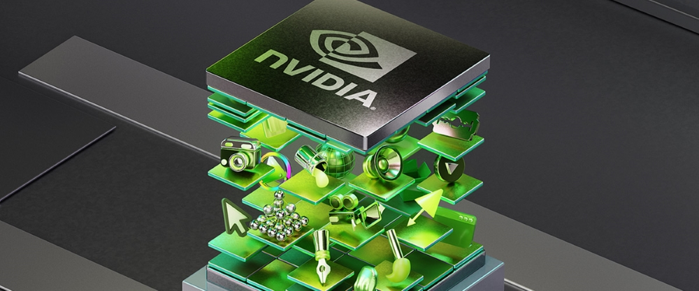
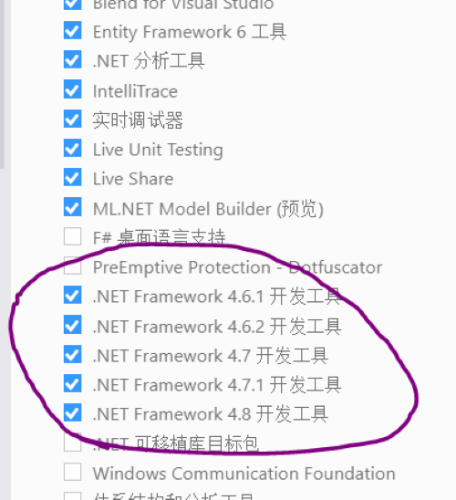
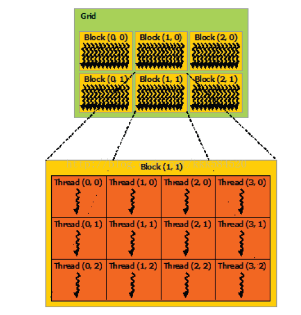
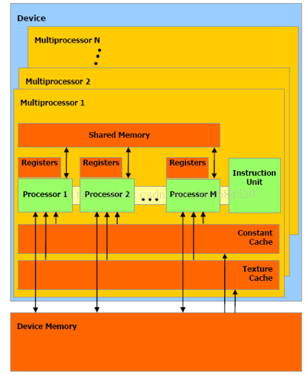

# CUDA编程

## 搭建编程环境
我遇到了很多的麻烦，特别搞心态。

因为CLion支持CUDA-Excutable，加上我惯用CLion，所以试了很久很久，一直疯狂报错，特别恶心。 
即便我把CLion的版本、CUDA的版本、编译器的类型(从MingGW到VisualStudio)反复调整，也不能解决。

我后来决心专门用VisualStudio开发，但是VisualStudio创建的项目类型不包含CUDA，找来找去也找不到，很无奈。

直到我发现要安装.NET Framework的支持才可以做CUDA编程： 

Bingo!

## 线程并行与块并行
- [线程并行练习](cuda_array_add)
- [块并行练习](block_level_parallelism)

线程并行是细粒度并行，调度效率高；块并行是粗粒度并行，每次调度都要重新分配资源，有时资源只有一份，那么所有线程块都只能排成一队，串行执行。 
二者各有利弊：我们的任务有时可以采用分治法，将一个大问题分解为几个小规模问题，将这些小规模问题分别用一个线程块实现，线程块内可以采用细粒度的线程并行，而块之间为粗粒度并行，这样可以充分利用硬件资源，降低线程并行的计算复杂度。适当分解，降低规模，在一些矩阵乘法、向量内积计算应用中可以得到充分的展示。 
实际应用中，常常是二者的结合。线程块、线程组织图如下所示： 
 
多个线程块组织成了一个Grid，称为线程格。

## 流并行
- [流并行练习](thread_level_parallelism)

\<\<\<\>\>\>中的参数多了两个，其中前两个和块并行、线程并行中的意义相同，仍然是线程块数（这里为1）、每个线程块中线程数（这里也是1）。第三个为0表示每个block用到的共享内存大小，这个我们后面再讲；第四个为流对象，表示当前核函数在哪个流上运行。我们创建了5个流，每个流上都装载了一个核函数，同时传递参数有些不同，也就是每个核函数作用的对象也不同。这样就实现了任务级别的并行，当我们有几个互不相关的任务时，可以写多个核函数，资源允许的情况下，我们将这些核函数装载到不同流上，然后执行，这样可以实现更粗粒度的并行。

## 进程间通信
- [进程间通信练习](process_communication)

